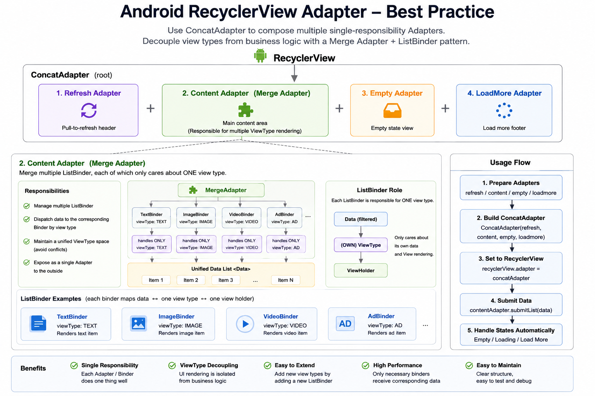

# OneList

[](README_zh.md)

A lightweight Android RecyclerView Adapter framework that simplifies common scenarios like multi-type lists, diff-based updates, pagination, and pull-to-refresh.

## Installation

```kotlin
implementation("io.github.ergoolee:onelist:1.0.0")
```

## Architecture



## Pain Points & Best Practices

Traditional RecyclerView Adapter development suffers from the following pain points:

| # | Pain Point | Traditional Approach | OneList Solution |
|---|---|---|---|
| 1 | **Multi-type boilerplate** | A single Adapter handles all view types with massive `when`/`switch` blocks in `onCreateViewHolder` and `onBindViewHolder`, leading to bloated, hard-to-maintain code | Each type is encapsulated in its own `ListBinder` — single responsibility, independently testable, and infinitely composable |
| 2 | **Inefficient updates** | Manual `notifyDataSetChanged()` or error-prone `notifyItemXxx()` calls | Built-in `AsyncListDiffer` via `DifferAdapter` / `DifferMergeAdapter` — just call `submitList()` and let the framework compute minimal diffs on a background thread |
| 3 | **Click listener leaks** | Listeners set in `onBindViewHolder` may hold stale references; forgetting to clear them causes memory leaks | Listeners are automatically bound in `onViewAttachedToWindow` and unbound in `onViewDetachedFromWindow` — zero risk of leaks |
| 4 | **Pagination complexity** | Manual scroll listeners, threshold calculations, and state management | `LoadMoreAdapter` with configurable `preloadSize` and direction detection, simply combined via `ConcatAdapter` |
| 5 | **Pull-to-refresh coupling** | Tightly coupling `SwipeRefreshLayout` logic into Activity/Fragment | `RefreshAdapter` + `RefreshView` provide a self-contained refresh lifecycle, fully decoupled from the page |
| 6 | **First-page state management** | Manually toggling between loading, empty, and error views with `ViewSwitcher` or visibility flags scattered across Fragment/Activity | `EmptyContentAdapter` automatically manages loading / empty / error states for the first page — just set the state and the UI updates itself |
| 7 | **Grid span management** | Manually setting `SpanSizeLookup` and tracking positions across multiple adapters | `OneListGridLayoutManager` + `Spannable` / `FullSpan` interfaces — each Binder declares its own span, the framework handles the rest |

### The Best Practice — "Binder-per-Type" Architecture

As shown in the diagram above, the recommended architecture follows these principles:

1. **One `ListBinder` per view type** — Each binder owns its layout, binding logic, and click handling. Adding a new card type means adding a new Binder with zero changes to existing code (Open/Closed Principle).
2. **Compose via `DifferMergeAdapter`** — Register all binders in one adapter; the framework dispatches creation and binding by data class type.
3. **Automatic diff computation** — Feed heterogeneous data lists via `submitList()`; the `MergeItemCallback` routes `areItemsTheSame` / `areContentsTheSame` to each binder's type.
4. **Decoupled pagination & refresh** — Use `ConcatAdapter` to stack `RefreshAdapter` + content adapter + `LoadMoreAdapter`. Each piece is independently reusable.
5. **Declarative span & full-span** — Binders implement `Spannable` or mark themselves as `FullSpan`; no global lookup table needed.

## Features

- 🧩 **Multi-Type Lists** — Use the `ListBinder` mechanism to map each data type to its own Binder, effortlessly building complex heterogeneous lists
- 🔄 **DiffUtil Support** — Built-in `DifferAdapter` / `DifferMergeAdapter` powered by `AsyncListDiffer` for automatic background diff computation and efficient updates
- 📄 **Paging 3 Integration** — `OneListPagingAdapter` seamlessly integrates with Jetpack Paging 3, avoiding unnecessary prefetch triggers
- ⬇️ **Load More** — `LoadMoreAdapter` works with `ConcatAdapter` for bottom/top pagination with configurable preload threshold and scroll direction detection
- 🔃 **Pull-to-Refresh** — `RefreshAdapter` + `RefreshView` provide a complete pull-to-refresh UI and lifecycle management
- 👆 **Click Handling** — Unified item-level and child-view click/long-click management, bound/unbound on view attach/detach to prevent memory leaks
- 📐 **Grid & StaggeredGrid** — `OneListGridLayoutManager` + `Spannable` interface for custom span sizes and full-span items
- 📎 **ViewBinding** — `BindingViewHolder` directly holds a ViewBinding instance
- 🎯 **Single-Item Adapter** — `OneItemAdapter` for conditionally displaying headers, footers, empty states, or loading indicators

## Requirements

- **minSdk** 10
- **compileSdk** 36
- AndroidX

## Core Classes

| Class | Description |
|---|---|
| `OneListAdapter` | Base class for all adapters, providing click events, span support, etc. |
| `MutableListAdapter` | Mutable data list adapter with add / remove / swap operations |
| `DifferAdapter` | Single-type adapter based on AsyncListDiffer |
| `MergeAdapter` | Multi-type adapter that delegates creation and binding to `ListBinder` instances |
| `DifferMergeAdapter` | Multi-type + DiffUtil adapter |
| `ListBinder` | Delegate for view creation, binding, and event handling of a single type in multi-type lists |
| `OneItemAdapter` | 0-or-1 item adapter for state-driven headers/footers |
| `OneListPagingAdapter` | Paging 3 integration adapter |
| `LoadMoreAdapter` | Load-more adapter, used with ConcatAdapter |
| `RefreshAdapter` / `RefreshView` | Pull-to-refresh adapter and UI interface |
| `BindingViewHolder` | ViewHolder that holds a ViewBinding instance |
| `OneListGridLayoutManager` | GridLayoutManager with Spannable interface support |

## Quick Start

### Single-Type List (DiffUtil)

```kotlin
class MyAdapter : DifferAdapter<MyItem, BindingViewHolder<ItemBinding>>(
    object : DiffUtil.ItemCallback<MyItem>() {
        override fun areItemsTheSame(old: MyItem, new: MyItem) = old.id == new.id
        override fun areContentsTheSame(old: MyItem, new: MyItem) = old == new
    }
) {
    override fun onCreateViewHolder(context: Context, parent: ViewGroup, viewType: Int) =
        BindingViewHolder(ItemBinding.inflate(LayoutInflater.from(context), parent, false))

    override fun onBindViewHolder(holder: BindingViewHolder<ItemBinding>, position: Int, item: MyItem) {
        holder.binding.title.text = item.title
    }
}

// Usage
adapter.submitList(listOf(...))
adapter.itemClickListener = object : ClickListener<MyItem, BindingViewHolder<ItemBinding>> {
    override fun onClick(data: MyItem, view: View, holder: BindingViewHolder<ItemBinding>) { }
}
```

### Multi-Type List

```kotlin
class MyMergeAdapter : DifferMergeAdapter() {
    init {
        addListBinder(HeaderBinder())
        addListBinder(ContentBinder())
    }
}

class HeaderBinder : ListBinder<HeaderData, BindingViewHolder<HeaderBinding>>() {
    override fun getViewType() = R.layout.item_header
    override fun onCreateViewHolder(parent: ViewGroup, viewType: Int) =
        BindingViewHolder(HeaderBinding.inflate(LayoutInflater.from(parent.context), parent, false))
    override fun convert(holder: BindingViewHolder<HeaderBinding>, data: HeaderData) {
        holder.binding.title.text = data.title
    }
}
```

### Load More

```kotlin
val contentAdapter = MyAdapter()  // implements MainContentAdapter
val loadMoreAdapter = MyLoadMoreAdapter()
loadMoreAdapter.preloadSize = 5

recyclerView.adapter = ConcatAdapter(contentAdapter, loadMoreAdapter)
```

## Complete Example

The following example demonstrates a full-featured list page with pull-to-refresh, multi-type content, first-page state management (loading/empty/error), and load-more pagination — all composed via `ConcatAdapter`.

### 1. Define Binder for each view type

```kotlin
// Each card type gets its own ListBinder
class VerticalVideoListBinder : ListBinder<VerticalVideo, VerticalVideoViewHolder>() {

    override fun getViewType() = R.layout.vertical_video_layout

    override fun onCreateViewHolder(parent: ViewGroup, viewType: Int): VerticalVideoViewHolder {
        val binding = VerticalVideoLayoutBinding.inflate(
            LayoutInflater.from(parent.context), parent, false
        )
        return VerticalVideoViewHolder(binding)
    }

    override fun convert(holder: VerticalVideoViewHolder, data: VerticalVideo) {
        holder.bind(data)
    }

    // Partial update via payloads
    override fun convert(holder: VerticalVideoViewHolder, data: VerticalVideo, payloads: List<Any>) {
        if (payloads.contains("like")) {
            holder.setLikeStatus(data.liked)
        } else {
            convert(holder, data)
        }
    }

    // Grid span: 2 columns
    override fun spanCount(): Int = 2

    companion object {
        val DIFF_CALLBACK = object : DiffUtil.ItemCallback<VerticalVideo>() {
            override fun areItemsTheSame(old: VerticalVideo, new: VerticalVideo) = old.id == new.id
            override fun areContentsTheSame(old: VerticalVideo, new: VerticalVideo) = old == new
            override fun getChangePayload(old: VerticalVideo, new: VerticalVideo): Any? {
                return if (old.liked != new.liked) "like" else super.getChangePayload(old, new)
            }
        }
    }
}
```

### 2. Compose content adapter with multiple Binders

```kotlin
class HomeContentAdapter : DifferMergeAdapter(), MainContentAdapter {

    val titleBinder = FloorTitleListBinder()
    val verticalVideoBinder = VerticalVideoListBinder()
    val horizontalVideoBinder = HorizontalVideoListBinder()

    init {
        addListBinder(titleBinder, FloorTitleListBinder.DIFF_CALLBACK)
        addListBinder(verticalVideoBinder, VerticalVideoListBinder.DIFF_CALLBACK)
        addListBinder(horizontalVideoBinder, HorizontalVideoListBinder.DIFF_CALLBACK)
    }
}
```

### 3. Create a LoadStateView for first-page states

```kotlin
// A multi-state view supporting loading / empty / error with retry
val loadStateView = LoadStateView(context).apply {
    layoutParams = ViewGroup.LayoutParams(MATCH_PARENT, MATCH_PARENT)
}
```

### 4. Assemble everything in the Fragment

```kotlin
class HomeFragment : Fragment() {

    override fun onViewCreated(view: View, savedInstanceState: Bundle?) {
        super.onViewCreated(view, savedInstanceState)

        // 1️⃣ Create adapters
        val contentAdapter = HomeContentAdapter()
        val refreshAdapter = RefreshAdapter(OneListRefreshView(context))
        val loadMoreAdapter = BottomLoadMoreAdapter(OneListBottomLoadMore(context))
        val emptyAdapter = EmptyContentAdapter(loadStateView)

        // 2️⃣ Compose via ConcatAdapter
        recyclerView.adapter = ConcatAdapter(
            refreshAdapter,   // pull-to-refresh
            contentAdapter,   // multi-type content
            emptyAdapter,     // first-page loading/empty/error
            loadMoreAdapter,  // load-more pagination
        )

        // 3️⃣ Submit data — just one line
        viewModel.uiState.onEach { contentAdapter.submitList(it.rows) }
            .launchIn(viewLifecycleOwner.lifecycleScope)

        // 4️⃣ First-page states — EmptyContentAdapter auto-shows when content is empty
        loadStateView.showLoading()            // initial loading
        loadStateView.showError("Network error") { viewModel.refresh() }  // error + retry
        // once contentAdapter has data, emptyAdapter hides automatically

        // 5️⃣ Click events — set on individual Binders
        contentAdapter.verticalVideoBinder.clickListener = SimpleClickListener { data, _ ->
            Toast.makeText(context, data.title, Toast.LENGTH_SHORT).show()
        }
    }
}
```

### Key Takeaways

| Concern | Handled by | Lines of code in Fragment |
|---|---|---|
| Multi-type rendering | `DifferMergeAdapter` + `ListBinder` per type | 0 (fully in Binders) |
| Diff updates | `submitList()` | 1 |
| First-page loading/error/empty | `EmptyContentAdapter` + `LoadStateView` | ~10 |
| Pull-to-refresh | `RefreshAdapter` | ~5 |
| Pagination | `BottomLoadMoreAdapter` | ~8 |
| Click handling | `ListBinder.clickListener` / `addOnItemChildClickListener` | per-binder |

The Fragment only orchestrates state flow — **zero view-type logic, zero manual notify calls, zero visibility toggling**.

## Project Structure

```
onelist/          # Core library module
demo/             # Sample application
```

## License

See the [LICENSE](LICENSE) file.
