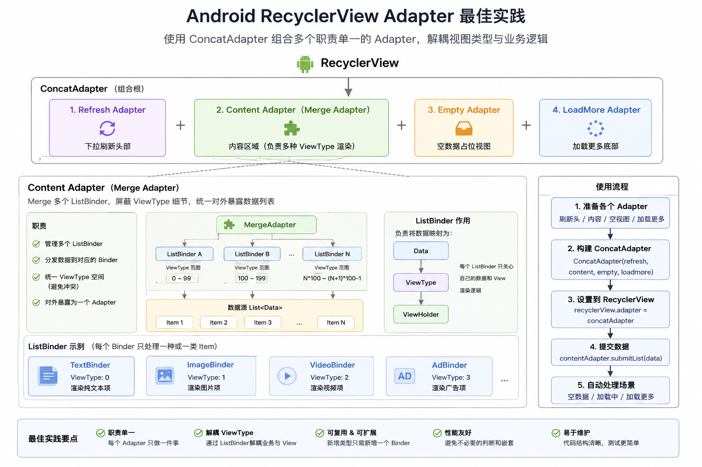

# OneList

[](README.md)

一个轻量级的 Android RecyclerView Adapter 框架，简化多类型列表、Diff 更新、分页加载、下拉刷新等常见场景的开发。

## 集成方式

```kotlin
implementation("io.github.ergoolee:onelist:1.0.0")
```

## 架构图



## 痛点与最佳实践

传统 RecyclerView Adapter 开发存在以下痛点：

| # | 痛点 | 传统做法 | OneList 方案 |
|---|---|---|---|
| 1 | **多类型代码膨胀** | 一个 Adapter 处理所有 viewType，`onCreateViewHolder` 和 `onBindViewHolder` 中充斥大量 `when`/`switch` 分支，难以维护 | 每种类型封装为独立的 `ListBinder` —— 职责单一、可独立测试、任意组合 |
| 2 | **低效的列表更新** | 手动调用 `notifyDataSetChanged()` 或容易出错的 `notifyItemXxx()` | 内置 `AsyncListDiffer`，通过 `DifferAdapter` / `DifferMergeAdapter` 只需 `submitList()`，框架自动在后台线程计算最小差异 |
| 3 | **点击事件内存泄漏** | 在 `onBindViewHolder` 中设置 Listener，可能持有过期引用；忘记清除会导致内存泄漏 | Listener 在 `onViewAttachedToWindow` 时绑定、`onViewDetachedFromWindow` 时解绑 —— 零泄漏风险 |
| 4 | **分页加载复杂** | 手动监听滚动、计算阈值、管理加载状态 | `LoadMoreAdapter` 支持可配置的 `preloadSize` 和方向检测，通过 `ConcatAdapter` 简单组合 |
| 5 | **下拉刷新耦合** | `SwipeRefreshLayout` 逻辑紧耦合在 Activity/Fragment 中 | `RefreshAdapter` + `RefreshView` 提供自包含的刷新生命周期，与页面完全解耦 |
| 6 | **首页加载状态管理困难** | 手动切换 Loading、空态、错误态视图，使用 `ViewSwitcher` 或在 Fragment/Activity 中散落大量 visibility 控制逻辑 | `EmptyContentAdapter` 自动管理首页的加载态、空态和错误态 —— 只需设置状态，UI 自动切换 |
| 7 | **Grid Span 管理困难** | 手动设置 `SpanSizeLookup`，跨多个 Adapter 追踪 position | `OneListGridLayoutManager` + `Spannable` / `FullSpan` 接口 —— 每个 Binder 声明自己的 span，框架统一处理 |

### 最佳实践 —— "每类型一个 Binder" 架构

如上图所示，推荐的架构遵循以下原则：

1. **一个 viewType 对应一个 `ListBinder`** —— 每个 Binder 拥有自己的布局、绑定逻辑和点击处理。新增卡片类型只需新增 Binder，无需修改已有代码（开闭原则）。
2. **通过 `DifferMergeAdapter` 组合** —— 将所有 Binder 注册到同一个 Adapter，框架根据数据类型自动分发创建和绑定。
3. **自动 Diff 计算** —— 通过 `submitList()` 传入异构数据列表，`MergeItemCallback` 自动路由 `areItemsTheSame` / `areContentsTheSame` 到各类型。
4. **分页与刷新解耦** —— 使用 `ConcatAdapter` 堆叠 `RefreshAdapter` + 内容 Adapter + `LoadMoreAdapter`，每个模块可独立复用。
5. **声明式 Span 与全宽** —— Binder 实现 `Spannable` 或标记为 `FullSpan`，无需全局查找表。

## 特性

- 🧩 **多类型列表** — 通过 `ListBinder` 机制，每种数据类型对应一个 Binder，轻松构建复杂的多类型列表
- 🔄 **DiffUtil 支持** — 内置 `DifferAdapter` / `DifferMergeAdapter`，基于 `AsyncListDiffer` 自动在后台线程计算差异并高效更新
- 📄 **Paging 3 集成** — `OneListPagingAdapter` 无缝对接 Jetpack Paging 3，避免不必要的预加载触发
- ⬇️ **加载更多** — `LoadMoreAdapter` 配合 `ConcatAdapter` 实现底部/顶部分页加载，支持预加载阈值和滚动方向检测
- 🔃 **下拉刷新** — `RefreshAdapter` + `RefreshView` 提供完整的下拉刷新 UI 和生命周期管理
- 👆 **点击事件** — 统一的 Item 级和子 View 级点击/长按事件管理，在 View attach/detach 时绑定/解绑，避免内存泄漏
- 📐 **Grid & StaggeredGrid** — `OneListGridLayoutManager` + `Spannable` 接口支持自定义 span 和全宽 item
- 📎 **ViewBinding** — 提供 `BindingViewHolder`，直接持有 ViewBinding 实例
- 🎯 **单 Item 适配器** — `OneItemAdapter` 用于 Header、Footer、空状态、Loading 等条件显示的单条目场景

## 环境要求

- **minSdk** 10
- **compileSdk** 36
- AndroidX

## 核心类

| 类 | 说明 |
|---|---|
| `OneListAdapter` | 所有适配器的基类，提供点击事件、Span 支持等通用能力 |
| `MutableListAdapter` | 可变数据列表适配器，支持 add / remove / swap 等操作 |
| `DifferAdapter` | 基于 AsyncListDiffer 的单类型适配器 |
| `MergeAdapter` | 多类型适配器，通过 `ListBinder` 委托不同类型的创建和绑定 |
| `DifferMergeAdapter` | 多类型 + DiffUtil 适配器 |
| `ListBinder` | 多类型列表中单个类型的视图创建、绑定和事件处理委托 |
| `OneItemAdapter` | 0 或 1 个条目的适配器，适用于状态驱动的 Header/Footer |
| `OneListPagingAdapter` | Paging 3 集成适配器 |
| `LoadMoreAdapter` | 加载更多适配器，配合 ConcatAdapter 使用 |
| `RefreshAdapter` / `RefreshView` | 下拉刷新适配器和 UI 接口 |
| `BindingViewHolder` | 持有 ViewBinding 的 ViewHolder |
| `OneListGridLayoutManager` | 支持 Spannable 接口的 GridLayoutManager |

## 快速开始

### 单类型列表（DiffUtil）

```kotlin
class MyAdapter : DifferAdapter<MyItem, BindingViewHolder<ItemBinding>>(
    object : DiffUtil.ItemCallback<MyItem>() {
        override fun areItemsTheSame(old: MyItem, new: MyItem) = old.id == new.id
        override fun areContentsTheSame(old: MyItem, new: MyItem) = old == new
    }
) {
    override fun onCreateViewHolder(context: Context, parent: ViewGroup, viewType: Int) =
        BindingViewHolder(ItemBinding.inflate(LayoutInflater.from(context), parent, false))

    override fun onBindViewHolder(holder: BindingViewHolder<ItemBinding>, position: Int, item: MyItem) {
        holder.binding.title.text = item.title
    }
}

// 使用
adapter.submitList(listOf(...))
adapter.itemClickListener = object : ClickListener<MyItem, BindingViewHolder<ItemBinding>> {
    override fun onClick(data: MyItem, view: View, holder: BindingViewHolder<ItemBinding>) { }
}
```

### 多类型列表

```kotlin
class MyMergeAdapter : DifferMergeAdapter() {
    init {
        addListBinder(HeaderBinder())
        addListBinder(ContentBinder())
    }
}

class HeaderBinder : ListBinder<HeaderData, BindingViewHolder<HeaderBinding>>() {
    override fun getViewType() = R.layout.item_header
    override fun onCreateViewHolder(parent: ViewGroup, viewType: Int) =
        BindingViewHolder(HeaderBinding.inflate(LayoutInflater.from(parent.context), parent, false))
    override fun convert(holder: BindingViewHolder<HeaderBinding>, data: HeaderData) {
        holder.binding.title.text = data.title
    }
}
```

### 加载更多

```kotlin
val contentAdapter = MyAdapter()  // 实现 MainContentAdapter 接口
val loadMoreAdapter = MyLoadMoreAdapter()
loadMoreAdapter.preloadSize = 5

recyclerView.adapter = ConcatAdapter(contentAdapter, loadMoreAdapter)
```

## 完整示例

以下示例展示了一个功能完整的列表页面，包含下拉刷新、多类型内容、首页状态管理（加载态/空态/错误态）以及上拉加载更多 —— 全部通过 `ConcatAdapter` 组合。

### 1. 为每种视图类型定义 Binder

```kotlin
// 每种卡片类型对应一个 ListBinder
class VerticalVideoListBinder : ListBinder<VerticalVideo, VerticalVideoViewHolder>() {

    override fun getViewType() = R.layout.vertical_video_layout

    override fun onCreateViewHolder(parent: ViewGroup, viewType: Int): VerticalVideoViewHolder {
        val binding = VerticalVideoLayoutBinding.inflate(
            LayoutInflater.from(parent.context), parent, false
        )
        return VerticalVideoViewHolder(binding)
    }

    override fun convert(holder: VerticalVideoViewHolder, data: VerticalVideo) {
        holder.bind(data)
    }

    // 通过 payloads 实现局部更新
    override fun convert(holder: VerticalVideoViewHolder, data: VerticalVideo, payloads: List<Any>) {
        if (payloads.contains("like")) {
            holder.setLikeStatus(data.liked)
        } else {
            convert(holder, data)
        }
    }

    // Grid span：占 2 列
    override fun spanCount(): Int = 2

    companion object {
        val DIFF_CALLBACK = object : DiffUtil.ItemCallback<VerticalVideo>() {
            override fun areItemsTheSame(old: VerticalVideo, new: VerticalVideo) = old.id == new.id
            override fun areContentsTheSame(old: VerticalVideo, new: VerticalVideo) = old == new
            override fun getChangePayload(old: VerticalVideo, new: VerticalVideo): Any? {
                return if (old.liked != new.liked) "like" else super.getChangePayload(old, new)
            }
        }
    }
}
```

### 2. 通过多个 Binder 组合内容 Adapter

```kotlin
class HomeContentAdapter : DifferMergeAdapter(), MainContentAdapter {

    val titleBinder = FloorTitleListBinder()
    val verticalVideoBinder = VerticalVideoListBinder()
    val horizontalVideoBinder = HorizontalVideoListBinder()

    init {
        addListBinder(titleBinder, FloorTitleListBinder.DIFF_CALLBACK)
        addListBinder(verticalVideoBinder, VerticalVideoListBinder.DIFF_CALLBACK)
        addListBinder(horizontalVideoBinder, HorizontalVideoListBinder.DIFF_CALLBACK)
    }
}
```

### 3. 创建 LoadStateView 管理首页状态

```kotlin
// 支持 loading / empty / error + 重试的多状态视图
val loadStateView = LoadStateView(context).apply {
    layoutParams = ViewGroup.LayoutParams(MATCH_PARENT, MATCH_PARENT)
}
```

### 4. 在 Fragment 中组装一切

```kotlin
class HomeFragment : Fragment() {

    override fun onViewCreated(view: View, savedInstanceState: Bundle?) {
        super.onViewCreated(view, savedInstanceState)

        // 1️⃣ 创建各 Adapter
        val contentAdapter = HomeContentAdapter()
        val refreshAdapter = RefreshAdapter(OneListRefreshView(context))
        val loadMoreAdapter = BottomLoadMoreAdapter(OneListBottomLoadMore(context))
        val emptyAdapter = EmptyContentAdapter(loadStateView)

        // 2️⃣ 通过 ConcatAdapter 组合
        recyclerView.adapter = ConcatAdapter(
            refreshAdapter,   // 下拉刷新
            contentAdapter,   // 多类型内容
            emptyAdapter,     // 首页加载态/空态/错误态
            loadMoreAdapter,  // 上拉加载更多
        )

        // 3️⃣ 提交数据 — 仅需一行
        viewModel.uiState.onEach { contentAdapter.submitList(it.rows) }
            .launchIn(viewLifecycleOwner.lifecycleScope)

        // 4️⃣ 首页状态 — EmptyContentAdapter 在内容为空时自动显示
        loadStateView.showLoading()            // 初始加载
        loadStateView.showError("网络错误") { viewModel.refresh() }  // 错误 + 重试
        // 一旦 contentAdapter 有数据，emptyAdapter 自动隐藏

        // 5️⃣ 点击事件 — 设置在各 Binder 上
        contentAdapter.verticalVideoBinder.clickListener = SimpleClickListener { data, _ ->
            Toast.makeText(context, data.title, Toast.LENGTH_SHORT).show()
        }
    }
}
```

### 要点总结

| 关注点 | 负责组件 | Fragment 中代码量 |
|---|---|---|
| 多类型渲染 | `DifferMergeAdapter` + 每类型一个 `ListBinder` | 0（全在 Binder 中） |
| Diff 更新 | `submitList()` | 1 行 |
| 首页加载态/错误态/空态 | `EmptyContentAdapter` + `LoadStateView` | ~10 行 |
| 下拉刷新 | `RefreshAdapter` | ~5 行 |
| 分页加载 | `BottomLoadMoreAdapter` | ~8 行 |
| 点击事件 | `ListBinder.clickListener` / `addOnItemChildClickListener` | 按 Binder 设置 |

Fragment 只负责状态流转 —— **零 viewType 判断、零手动 notify 调用、零 visibility 切换逻辑**。

## 项目结构

```
onelist/          # 核心库模块
demo/             # 示例应用
```

## License

见 [LICENSE](LICENSE) 文件。

